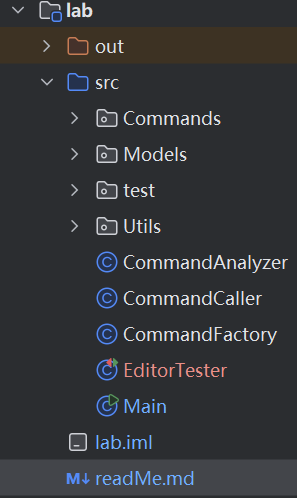
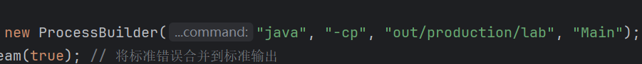

# HTML编辑器简介

很高兴和大家共同完成高级软件这门课的PJ，首先对目前的demo做一个简单的介绍

## 1. 模块简介，

作为demo，目前进行了简单的HTML预定义以及初始化指令的编写，包含

1. Main: 调用所有工具进行会话工作
2. CommandAnalyzer: 对输入指令进行初步合法性和状态判断，过滤不合法指令以及未初始化的情况
3. CommandCaller: 根据输入生成对应指令名+参数，调用简单工厂生成命令并执行
4. CommandFactory: 根据指令名生成对应指令模型
5. Commands: 抽象命令接口及各指令的实现
6. Models: 对指令实现进行封装
7. Utils: HTML对象的抽象定义、简单操作；HTML缓冲区

## 2. 编写注意事项
1. 目前已完成init指令的编写，各命令基于HTML缓冲区共享HTML内容
2. HTML缓冲区基于单例模式，各命令使用getInstance()方法获取HTML实例，保证唯一性。
3. 编辑器启动时，缓冲区为一个id为”empty"的HtmlElement；可以使用方法getHtmlContent()用于获取缓冲区内容。
4. 为了体现设计模式，实现基础指令需要新建对应的Commands类、Models类，并在CommandFactory中进行调用就可接入系统

## 3. 关于测试
测试的类是EditorTester
由于测试进程无法访问编辑器进程的存储空间，目前采用的交互方式是由编辑器进程输出缓冲区内容，在测试类完成判断
如果运行不成功可能是因为路径问题,ProcessBuilder默认是从工作目录下面拼接路径，如我的工作路径是Lab1/lab
所以我的编译文件夹out放在lab文件夹下

